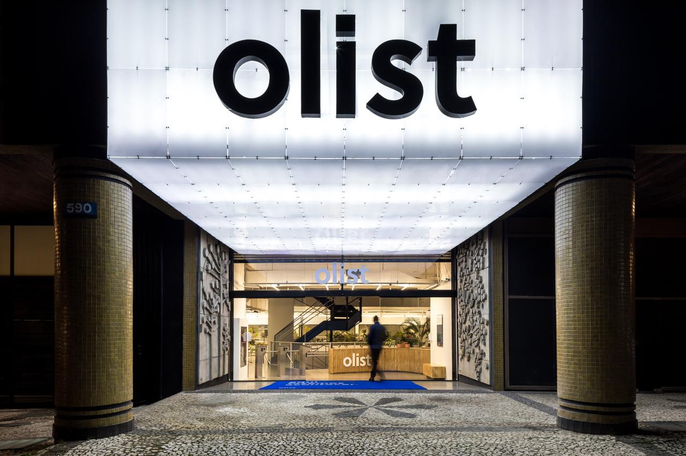
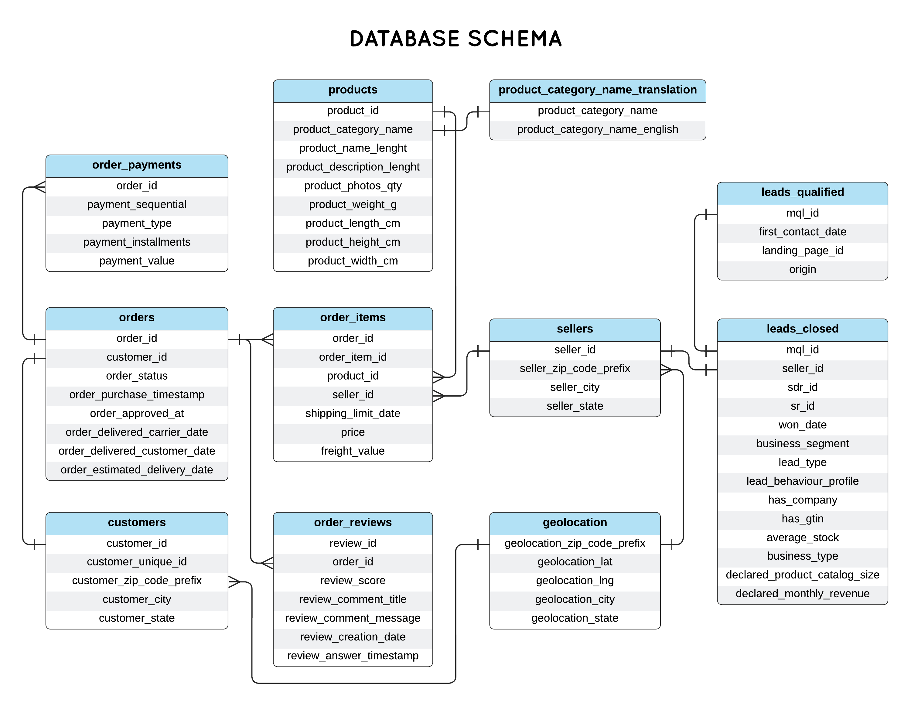
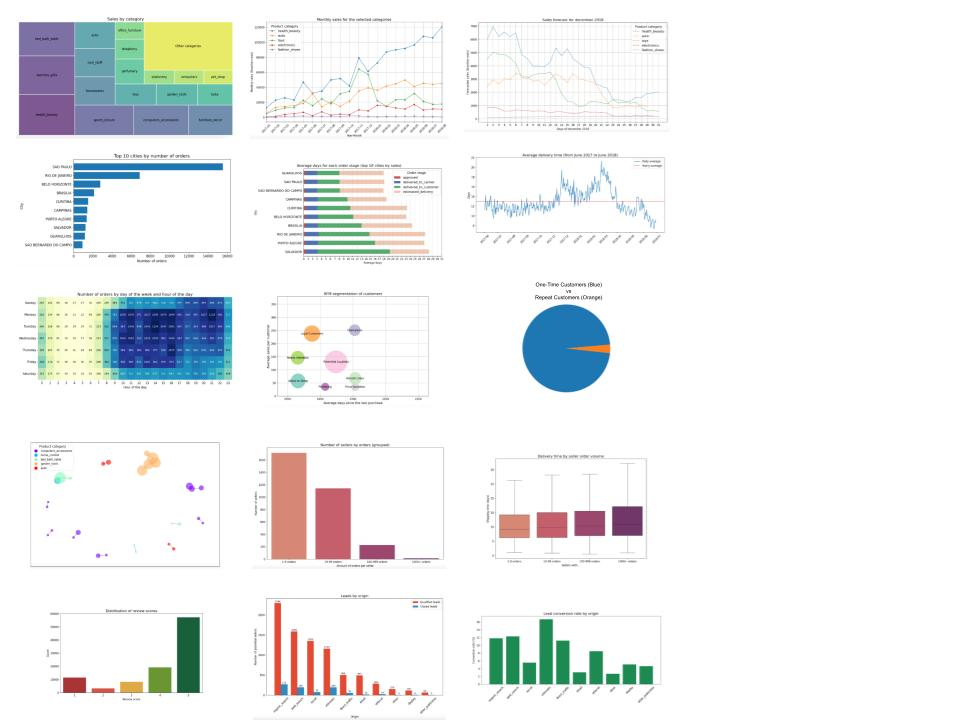

# Olist E-commerce Data Analysis

## Table of Contents:
1. [Project Background](#project-background)
2. [Targeted Insights](#targeted-insights)
3. [Data Visualizations](#data-visualizations)
4. [Executive Summary](#executive-summary)
5. [Recommendations](#recommendations)

# Project Background
[Back to Table of Contents](#table-of-contents)

Olist, a major Brazilian e-commerce platform, connects small businesses and sellers with larger online marketplaces across Brazil. They are often called the Amazon of Latin America. As Olist scales, it faces operational challenges, particularly in optimizing order fulfillment, customer satisfaction, and vendor performance. These challenges arise from the complex dynamics of order statuses, payment methods, freight logistics, and regional customer preferences.

This project conducts a focused SQL-based analysis on a dataset of 99,441 orders from March 2016 to August 2018, using relational database queries to extract key insights. The database schema can viewed below. Key areas of analysis include order completion rates, payment trends, freight efficiency, geographic purchasing patterns, and customer review sentiment. It is important to note that this is real commercial data, it has been anonymised, and references to the companies and partners in the review text have been replaced to preserve security.

By analyzing Olist’s e-commerce and customer data, this project aims to uncover meaningful trends and insights across areas such as order behavior, payment methods, and customer satisfaction. The findings will provide Olist with a clearer understanding of marketplace dynamics, operational challenges, and customer preferences, helping the company identify opportunities for operational improvements and profitable growth.

# Targeted Insights
[Back to Table of Contents](#table-of-contents)

The following insights were discovered through careful analysis of the Olist dataset in SQL. The full queries that led to these conclusions can all be found [here](sql).

**Summary of Targeted Insights:**

**Number of Orders**
- Order volume spiked in Christmas season, but the number of orders is steadily increasing overall as Olist grows
- Most orders are placed during weekdays, between 10 AM and 4 PM
- São Paulo and Rio de Janerio have the largest order volume by a wide margin of all the cities Olist operates in

**Order Prices**
- The average order price is 160.58 BRL or 28.13 USD
- The cheapest order price is 9.59 BRL (1.68 USD), while the most expensive is 13664.08 BRL (2394.06 USD)
- The distribution of order prices is skewed right, meaning that most orders have a low price with expensive products as outliers

**Product Categories**
- The most popular product categories are health and beauty; watches; bed, baths, and tables; sports leisure; and computer accessories
- The least popular product categories are flowers; home comfort; cds, dvds, and musicals; security and services; and fashion children clothes

**Sales Forecast**
- Health and beauty products are predicted to continue being the best selling category
- Categories like toys are seasonal, spiking only during the Christmas season
- Categories like fashion shoes have remained stagnant and are not expected to grow

**Order Delivery**
- The cities with the fastest order delivery are São Paulo, Guarulhos, and São Bernardo do Campo (average of 5 days)
- The cities with the slowest order delivery are Rio de Janeiro, Porto Alegre, and Salvador (average of 10+ days)
- Order delivery times slow down the most in December when compared to the yearly average

**Order Review**
- Reviews are mostly positive, with 4 stars and 5 stars being the most common response
- There is a relevant amount of 1 star reviews, which is concerning
- The common thread between negative reviews are complaints about delivery delays

**Customer Analysis**
- Olist's most loyal customers purchase an average of 237 BRL in products
- The majority of customers are one-time purchasers versus repeat customers 

**Product Groupings**
- There are 5 products in the garden tool category that are often purchased together
- Products in the auto and computer accesory categories are often purchased together

**Seller Analysis**
- Most of Olist's sellers are small, with 1600+ sellers having less than 10 orders
- A small proportion of Olist sellers (~200) command an order volume of 100+
- The larger the seller is, the longer the delivery time

**Lead Conversion**
- Only a small proportion of qualified leads become Olist sellers
- The largest sources of qualified leads are organic and paid search
- Despite still being low, organic and paid search have the best conversion rate of all the lead sources

# Data Visualizations
[Back to Table of Contents](#table-of-contents)

The data visualization above was created in python with Matplotlib and Seaborn with respect to the intelligence gathered in the [Targeted Sights](targeted-insights) section. The full notebook and code can be found [here](python/olist_eda.ipynb).

# Executive Summary
[Back to Table of Contents](#table-of-contents)

1. 

# Recommendations
[Back to Table of Contents](#table-of-contents)

Based on the uncovered insights, the following recommendations have been provided:

1.
