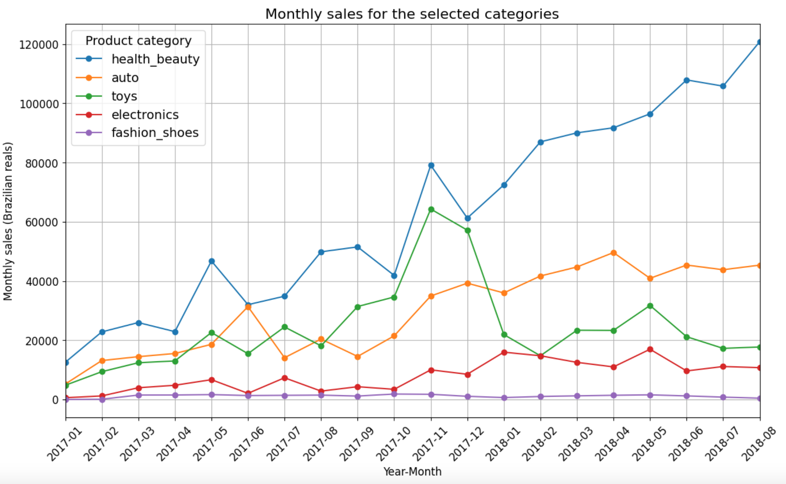
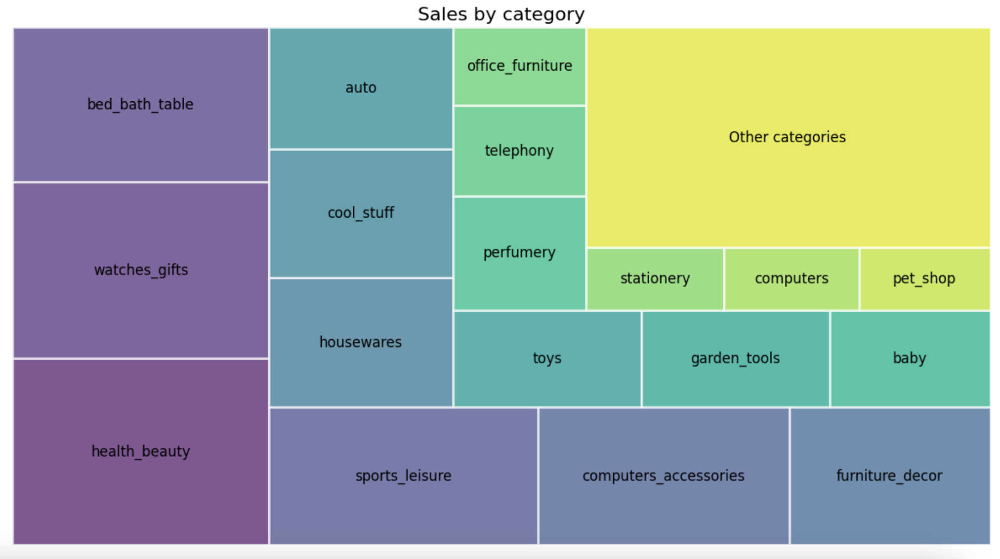
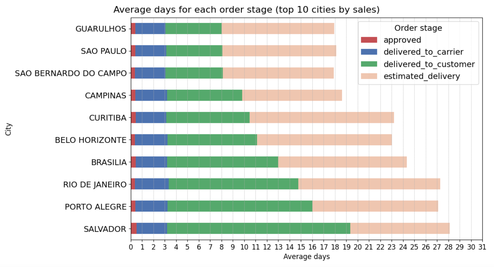
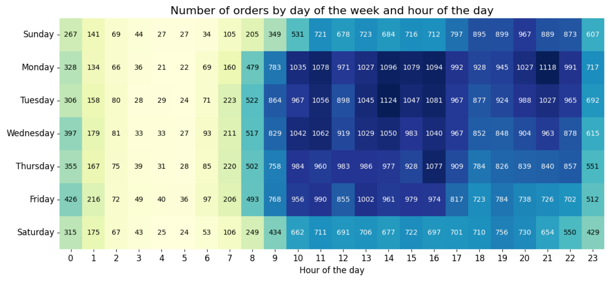
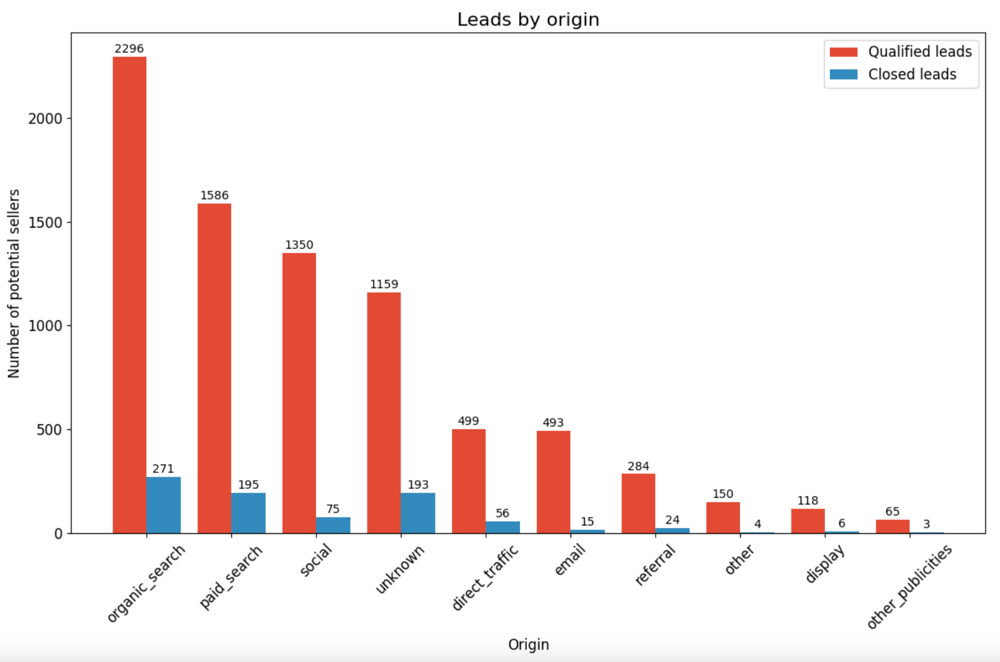

# Olist E-commerce Data Analysis

## Table of Contents:
1. [Project Background](#project-background)
2. [Data Structure](#data-structure)
3. [Targeted Insights](#targeted-insights)
4. [Data Visualizations](#data-visualizations)
5. [Recommendations](#recommendations)

# Project Background
[Back to Table of Contents](#table-of-contents)

Olist, a major Brazilian e-commerce platform, connects small businesses and sellers with larger online marketplaces across Brazil. They are often called the Amazon of Latin America. As Olist scales, it faces strategic challenges, particularly how to best allocate resources optimize product performance, customer satisfaction, and seller success.
To answer this pressing issue, Olist has collected a wide breadth of data regarding their e-commerce platform, and the goal of this project will be to analyze that data and extract key business insights. It is important to note that this is real commercial data, however, it has been anonymised, and references to the companies and partners in the review text have been replaced to preserve privacy.

This project conducts a focused SQL-based e-commerce analysis on a dataset of 99,441 orders from March 2016 to August 2018, using relational database queries to uncover critical insights and business metrics. The analysis will cover the following major areas: number of orders, order prices, product categories, sales forecasts, order deliveries, order reviews, customer segmentation, product groupings, seller profiles, and lead conversions. A summary of targeted insights will then be compiled based on the results of the analysis.

By examining and visualizing Olist’s e-commerce and customer data, this project aims to uncover meaningful trends and insights across Olist's products, customers, and sellers. The findings will provide Olist with a clearer understanding of marketplace dynamics, customer preferences, and seller challenges, helping the company identify strategic opportunities for operational improvements and profitable growth.

# Data Structure
[Back to Table of Contents](#table-of-contents)

Olist's database structure can be seen below in the entity relationship diagram (ERD). It consists of 11 tables in a SQLite file: orders, order_items, order_payments, order_reviews, products, prodyct_category_name_translation, customers, geolocation, sellers, leads_qualified, and leads_closed. Prior to beginning the analysis, a variety of checks were conducted for quality control and and familiarization with the datasets.

# Targeted Insights
[Back to Table of Contents](#table-of-contents)

**Summary of Targeted Insights:**

**Number of Orders**
- Order volume spiked in Christmas season, but the number of orders is steadily increasing overall as Olist grows
- Most orders are placed during weekdays, between 10 AM and 4 PM
- São Paulo and Rio de Janerio have the largest order volume by a wide margin of all the cities Olist operates in

**Order Prices**
- The average order price is 160.58 BRL or 28.13 USD
- The cheapest order price is 9.59 BRL (1.68 USD), while the most expensive is 13664.08 BRL (2394.06 USD)
- The distribution of order prices is skewed right, meaning that most orders have a low price with expensive products as outliers

**Product Categories**
- The most popular product categories are health and beauty; watches; bed, baths, and tables; sports leisure; and computer accessories
- The least popular product categories are flowers; home comfort; cds, dvds, and musicals; security and services; and fashion children clothes

**Sales Forecast**
- Health and beauty products are predicted to continue being the best selling category
- Categories like toys are seasonal, spiking only during the Christmas season
- Categories like fashion shoes have remained stagnant and are not expected to grow

**Order Delivery**
- The cities with the fastest order delivery are São Paulo, Guarulhos, and São Bernardo do Campo (average of 5 days)
- The cities with the slowest order delivery are Rio de Janeiro, Porto Alegre, and Salvador (average of 10+ days)
- Order delivery times slow down the most in December when compared to the yearly average

**Order Review**
- Reviews are mostly positive, with 4 stars and 5 stars being the most common response
- There is a relevant amount of 1 star reviews, which is concerning
- The common thread between negative reviews are complaints about delivery delays

**Customer Analysis**
- Olist's most loyal customers purchase an average of 237 BRL in products
- The majority of customers are one-time purchasers versus repeat customers 

**Product Groupings**
- There are 5 products in the garden tool category that are often purchased together
- Products in the auto and computer accesory categories are often purchased together

**Seller Analysis**
- Most of Olist's sellers are small, with 1600+ sellers having less than 10 orders
- A small proportion of Olist sellers (~200) command an order volume of 100+
- The larger the seller is, the longer the delivery time

**Lead Conversion**
- Only a small proportion of qualified leads become Olist sellers
- The largest sources of qualified leads are organic and paid search, which are also among the best conversion rates
- The source with the best conversion rate is listed as unknown

The following insights were discovered through careful analysis of the Olist dataset in SQL. The queries that led to these conclusions can all be found [here](sql).

# Data Visualizations
[Back to Table of Contents](#table-of-contents)

The data visualizations above were created in python with Matplotlib and Seaborn with respect to the intelligence gathered in the [Targeted Sights](targeted-insights) section. The full notebook and code with even more visualizations can be found [here](python/olist_eda.ipynb).

# Recommendations
[Back to Table of Contents](#table-of-contents)

Based on the uncovered insights, the following recommendations have been provided:

1. **Optimize Product Offerings:** Reassess the stagnant product categories, such as fashion shoes and flowers, and consider reallocating resources toward consistently high-performing categories like health and beauty or seasonal items with high sales potential. In regards to low-demand categories, the questions remains: should these products be scaled back or phased out? A deeper cost-benefit analysis is required to provide a definitive answer.

2. **Enhance Delivery Logistics:** Prioritize logistics improvements in cities with slower delivery times, Rio de Janeiro, Porto Alegre, and Salvador, to address the primary source of negative reviews. Rio de Janeiro especially is high priority due to the city having the second largest order volume of Olist cities. Plans must be made to assess partnerships with local carriers, investigate options for distribution centers closer to high-demand regions, and perform seasonal forecasting to mitigate December delays.

3. **Increase Customer Retention:** Because repeat customers are relatively low, implement retention strategies such as, loyalty programs, targeted email campaigns, or exclusive deals to convert one-time buyers into repeat customers. Conduct A/B tests to identify which retention strategies yield the highest engagement and repeat purchase rates. based on the data, answer these questions: What incentives would encourage one-time customers to return? Is there a common thread between repeat customers that can be taken advantage of?

4. **Refine Lead Conversion Strategy:** Focus marketing efforts on organic and paid search channels, which yield the highest conversion rates, while optimizing the seller onboarding process to improve conversion rates from qualified leads. Questions to investigate include: what are barriers in the current onboarding process? What are the main lead drop-off points? What are the factors that influence why certain leads convert or do not convert? Based on the results of this investigation, adjust marketing messaging to highlight Olist’s value proposition to prospective sellers.
